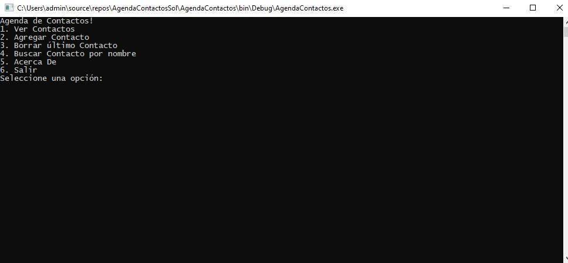
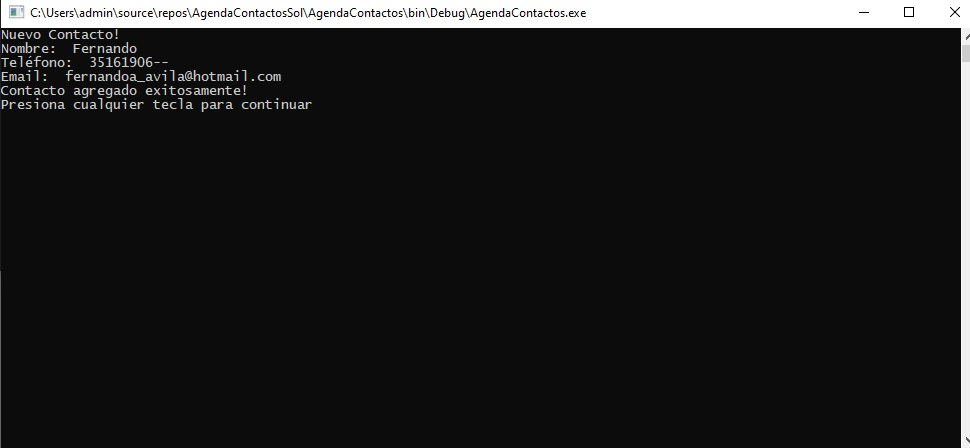
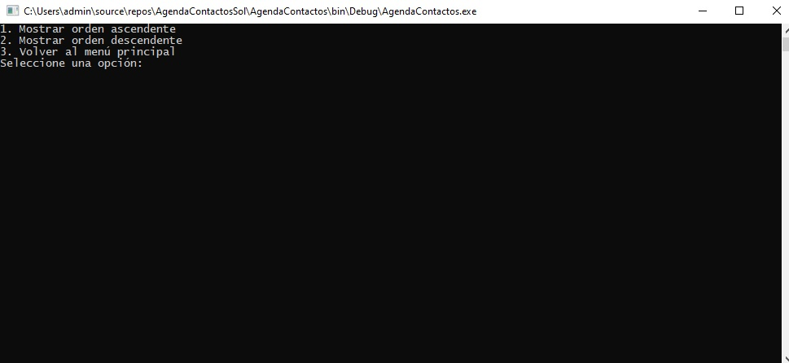
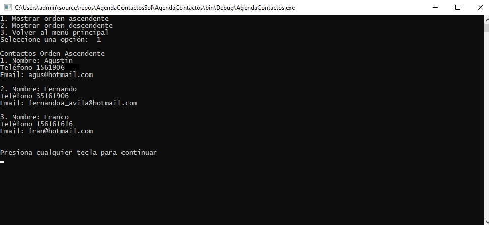
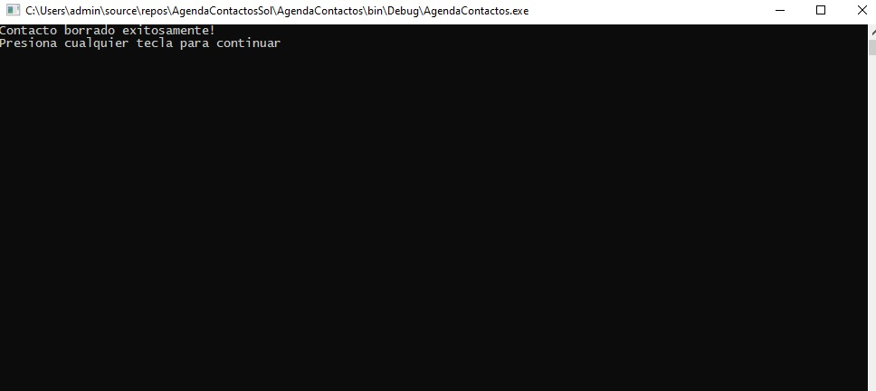
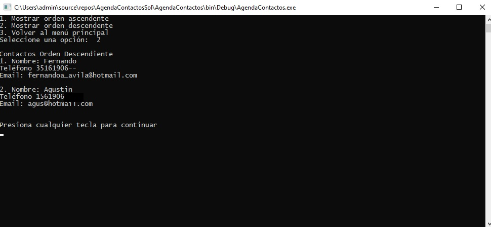
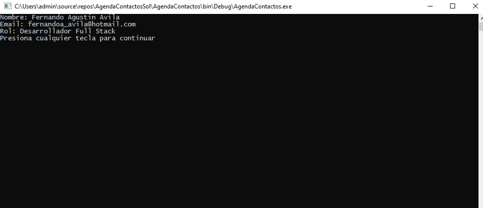

# Agenda Contactos

Utilizando Net Framework, con el lenguaje C# cree esta aplicación de consola para una agenda de contactos

## Vistas

### Inicio 

### Agregar contacto 

### Ver

### Ver de forma ascendente

### Borrado el último contacto

### Ver contactos de forma descendente
Tras borrar el último contacto vemos los contactos de forma descendente

### Acerca de

## Uso
Para poder usar/probar la aplicación de consola. Descargan el repositorio, abren la carpeta

**AgendaContactos -> bin -> Debug**

Dentro de la carpeta Debug hacen click en 

**AgendaContactos.exe**
